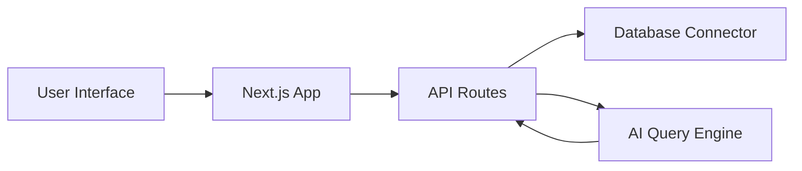
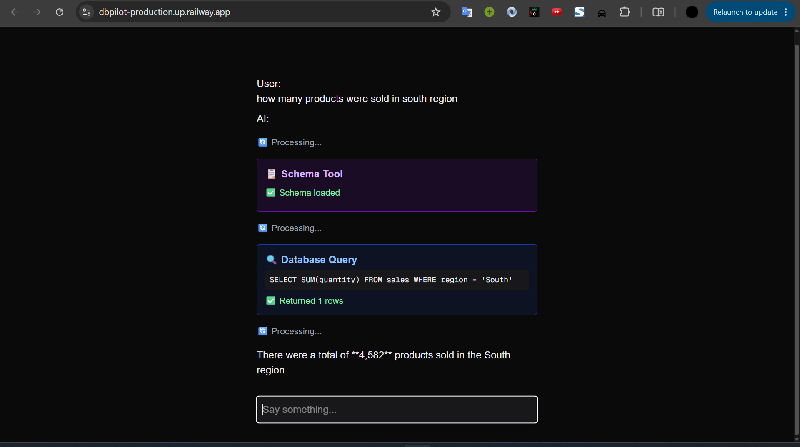
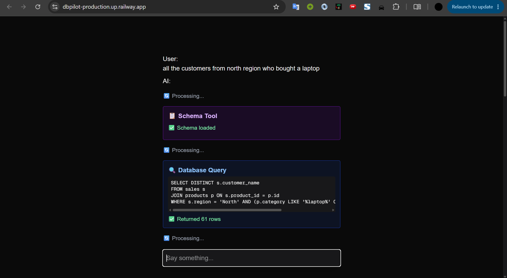
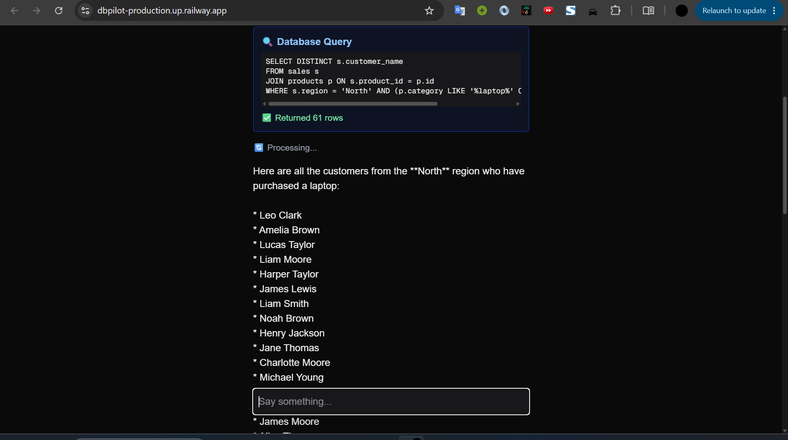
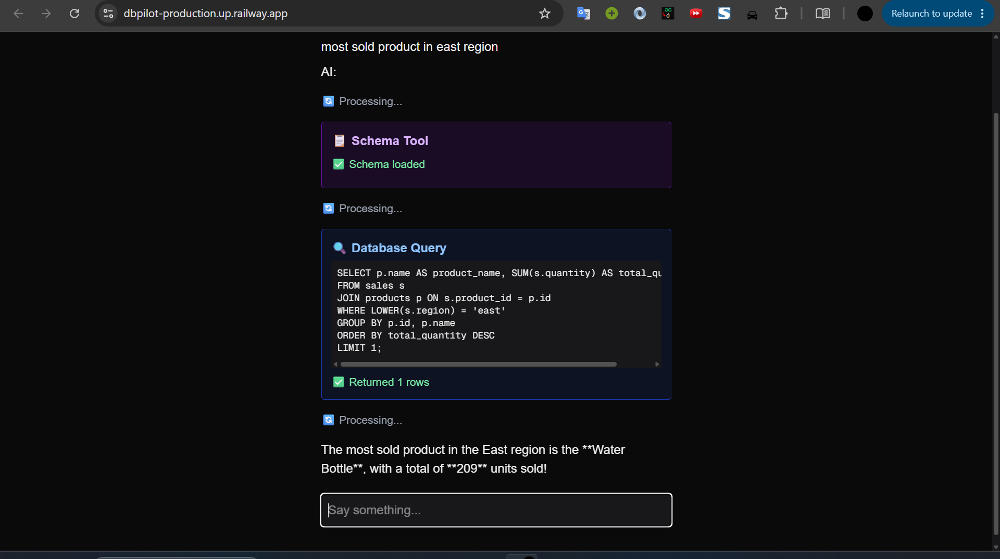

# DBPilot

A polished AI-first database workspace that turns schema exploration and SQL generation into a guided, production-ready workflow. DBPilot combines intelligent query drafting, schema-aware suggestions, and result previews so data engineers and analysts can move from question to answer with confidence.

## 🌐 Live Demo

[View Live Demo](https://dbpilot-production.up.railway.app/)

---


---

## 🌐 Overview

DBPilot is designed for developers and teams who need fast, accurate SQL generation and database exploration without switching tools. It simplifies common data workflows by turning natural-language intent into optimized queries, surfacing schema context, and making query results immediately actionable.

The experience feels like a modern database cockpit: intuitive, responsive, and built for both rapid prototyping and production-ready analysis.

---

## ✨ Feature Set

- 🧠 Natural-language SQL generation from plain English prompts
- 🗂 Schema explorer with table and column context
- ⚡ Query editor with instant execution previews
- 📊 Result visualization and export-ready output
- 📁 Query history and reusable snippets
- 🌙 Clean, responsive UI for desktop and tablet workflows

---

## 🤖 AI Features and Backend

DBPilot includes an AI assistant that helps generate and optimize SQL queries.

The assistant supports:

- 🧩 SQL generation from user intent
- 🧠 Schema-aware query suggestions
- ✅ Query optimization and refactoring hints
- 📌 Contextual explanations for table relationships and joins

---

## 🧰 Tech Stack

- [Next.js](https://nextjs.org/) – application framework
- [TypeScript](https://www.typescriptlang.org/) – typed front-end and API code
- [React](https://reactjs.org/) – UI and interaction layer
- [Node.js](https://nodejs.org/) – server runtime
- [Railway](https://railway.app/) – deployment platform
- AI query assistant integrated via server-side API routes

---

## 🧩 System Architecture



---

## 📁 Project Structure

- `app/` – Next.js application routes and page layout
- `components/` – reusable UI components
- `lib/` – database, AI, and utility helpers
- public – static assets and icons
- screenshots – demo images for the README
- package.json – project dependencies and scripts

---

## 📸 Screenshots

| | |
|---|---|
|  |  |
|  |  |

---

## 🚀 Getting Started

### Prerequisites

- Node.js 18+
- npm / yarn / pnpm
- A supported database connection
- An AI service key for the query assistant

### Installation

```bash
git clone https://github.com/your-username/dbpilot.git
cd dbpilot
npm install
```

### Environment Setup

1. Copy the example environment file:
   ```bash
   cp .env.example .env.local
   ```

2. If there is no `.env.example`, create .env.local in the project root.

3. Add the required environment variables:

   - `DATABASE_URL` – Your database connection string
   - `OPENAI_API_KEY` – API key for the AI query assistant
   - `NEXT_PUBLIC_API_URL` – Optional base URL for public API access
   - `NEXTAUTH_SECRET` – If authentication is used in your app
   - Any additional values required by `app/` or `lib/` configuration

4. Confirm the .env.local file is not committed:
   - .gitignore should already include .env.local

### Run Locally

```bash
npm run dev
```

Open [http://localhost:3000](http://localhost:3000) to view DBPilot locally.

### Build for Production

```bash
npm run build
npm run start
```

### Railway Deployment

- Deploy the project on Railway
- Set the same environment variables in Railway project settings
- Ensure the database and AI service keys are configured in the deployed environment

---

## 📝 Notes

DBPilot is built to help teams move from data questions to actionable queries faster. Its AI-assisted workflow reduces friction, improves query accuracy, and makes database exploration more accessible for both developers and analysts.
